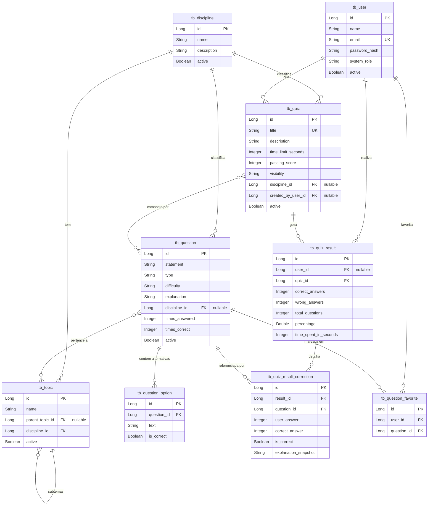

# Mapeamento do Modelo Relacional e Entidades (Fase 3)

Este documento traduz os esquemas flexíveis (NoSQL - MongoDB) atualmente em uso no projeto ContaQuiz para o modelo de Banco de Dados Relacional (PostgreSQL) e suas respectivas classes de modelo orientadas a objetos (Java / JPA).

Para evitar confusão, a documentação de cada entidade foi dividida estritamente em duas visões:
1. **Mundo Relacional (Tabela SQL):** Representa o desenho lógico no banco de dados, tipos de dados do PostgreSQL e chaves/índices.
2. **Mundo Orientado a Objetos (Entidade Java/JPA):** Representa a modelagem da classe no Quarkus com as anotações do JPA/Hibernate.

---

## 1. Mapeamento das Entidades de Domínio

### 1.1 Usuário (`User`)

#### A. Mundo Relacional (Tabela SQL)
* **Nome da Tabela:** `tb_user`
* **Definição de Colunas:**
  * `id` (BIGINT, PK, Auto-incremento / Serial)
  * `name` (VARCHAR(150), NOT NULL)
  * `email` (VARCHAR(150), UNIQUE, NOT NULL)
  * `password_hash` (VARCHAR(255), NOT NULL)
  * `system_role` (VARCHAR(20), NOT NULL, default 'ALUNO') — Valores aceitos: `ADMIN`, `ALUNO`
  * `active` (BOOLEAN, NOT NULL, default FALSE)
  * `created_at` (TIMESTAMP, NOT NULL)
  * `updated_at` (TIMESTAMP, NOT NULL)

#### B. Mundo Orientado a Objetos (Entidade Java / JPA)
* **Classe:** `User.java` (Estende `PanacheEntityBase` ou `PanacheEntity` se usar ID padrão)
* **Anotações da Classe:** `@Entity`, `@Table(name = "tb_user")`
* **Mapeamento de Atributos:**
  * `Long id` -> `@Id`, `@GeneratedValue(strategy = GenerationType.IDENTITY)`
  * `String name` -> `@Column(nullable = false, length = 150)`
  * `String email` -> `@Column(nullable = false, unique = true, length = 150)`
  * `String passwordHash` -> `@Column(name = "password_hash", nullable = false)`
  * `UserSystemRole systemRole` -> `@Enumerated(EnumType.STRING)`, `@Column(name = "system_role", nullable = false)`
  * `Boolean active` -> `@Column(nullable = false)`
  * `LocalDateTime createdAt` -> `@CreationTimestamp`, `@Column(name = "created_at", nullable = false, updatable = false)`
  * `LocalDateTime updatedAt` -> `@UpdateTimestamp`, `@Column(name = "updated_at", nullable = false)`

---

### 1.2 Disciplina (`Discipline`)

#### A. Mundo Relacional (Tabela SQL)
* **Nome da Tabela:** `tb_discipline`
* **Definição de Colunas:**
  * `id` (BIGINT, PK, Auto-incremento)
  * `name` (VARCHAR(100), NOT NULL)
  * `description` (VARCHAR(255))
  * `active` (BOOLEAN, NOT NULL, default TRUE)
  * `created_at` (TIMESTAMP, NOT NULL)
  * `updated_at` (TIMESTAMP, NOT NULL)

#### B. Mundo Orientado a Objetos (Entidade Java / JPA)
* **Classe:** `Discipline.java`
* **Anotações da Classe:** `@Entity`, `@Table(name = "tb_discipline")`
* **Mapeamento de Atributos:**
  * `Long id` -> `@Id`, `@GeneratedValue(strategy = GenerationType.IDENTITY)`
  * `String name` -> `@Column(nullable = false, length = 100)`
  * `String description` -> `@Column(length = 255)`
  * `Boolean active` -> `@Column(nullable = false)`

---

### 1.3 Tema / Subtema (`Topic`)

#### A. Mundo Relacional (Tabela SQL)
* **Nome da Tabela:** `tb_topic`
* **Definição de Colunas:**
  * `id` (BIGINT, PK, Auto-incremento)
  * `name` (VARCHAR(150), NOT NULL)
  * `discipline_id` (BIGINT, FK referenciando `tb_discipline(id)`, NOT NULL)
  * `parent_topic_id` (BIGINT, FK referenciando `tb_topic(id)`, NULLABLE) — Permite subtemas auto-referenciados
  * `active` (BOOLEAN, NOT NULL, default TRUE)

#### B. Mundo Orientado a Objetos (Entidade Java / JPA)
* **Classe:** `Topic.java`
* **Anotações da Classe:** `@Entity`, `@Table(name = "tb_topic")`
* **Mapeamento de Atributos:**
  * `Long id` -> `@Id`, `@GeneratedValue(strategy = GenerationType.IDENTITY)`
  * `String name` -> `@Column(nullable = false, length = 150)`
  * `Discipline discipline` -> `@ManyToOne(fetch = FetchType.LAZY)`, `@JoinColumn(name = "discipline_id", nullable = false)`
  * `Topic parentTopic` -> `@ManyToOne(fetch = FetchType.LAZY)`, `@JoinColumn(name = "parent_topic_id")`
  * `Boolean active` -> `@Column(nullable = false)`

---

### 1.4 Questão (`Question`) e Alternativas

No MongoDB, as alternativas eram um array de objetos dentro de uma questão. No relacional, normalizamos isso criando uma tabela secundária para as alternativas da questão.

#### A. Mundo Relacional (Tabela SQL)
* **Tabela Mestre:** `tb_question`
  * **Colunas:**
    * `id` (BIGINT, PK, Auto-incremento)
    * `statement` (TEXT, NOT NULL) — O enunciado da questão
    * `type` (VARCHAR(30), NOT NULL) — Valores: `MULTIPLA_ESCOLHA`, `CERTO_ERRADO`
    * `difficulty` (VARCHAR(20), NOT NULL) — Valores: `FACIL`, `MEDIO`, `DIFICIL`
    * `explanation` (TEXT) — Explicação/comentários do gabarito
    * `discipline_id` (BIGINT, FK referenciando `tb_discipline(id)`, NULLABLE)
    * `times_answered` (INTEGER, NOT NULL, default 0)
    * `times_correct` (INTEGER, NOT NULL, default 0)
    * `active` (BOOLEAN, NOT NULL, default TRUE)
* **Tabela Filha (Alternativas):** `tb_question_option`
  * **Colunas:**
    * `id` (BIGINT, PK, Auto-incremento)
    * `question_id` (BIGINT, FK referenciando `tb_question(id)`, NOT NULL)
    * `text` (VARCHAR(500), NOT NULL) — Texto ou HTML do item/alternativa
    * `is_correct` (BOOLEAN, NOT NULL, default FALSE)
* **Tabela Associativa (Mapeamento Tema-Questão):** `tb_question_topic`
  * **Colunas:**
    * `question_id` (BIGINT, FK para `tb_question(id)`)
    * `topic_id` (BIGINT, FK para `tb_topic(id)`)
    * *Chave Primária Composta:* `(question_id, topic_id)`

#### B. Mundo Orientado a Objetos (Entidade Java / JPA)
* **Classe:** `Question.java`
  * **Anotações da Classe:** `@Entity`, `@Table(name = "tb_question")`
  * **Atributos:**
    * `Long id` -> `@Id`, `@GeneratedValue(strategy = GenerationType.IDENTITY)`
    * `String statement` -> `@Column(columnDefinition = "TEXT", nullable = false)`
    * `QuestionType type` -> `@Enumerated(EnumType.STRING)`, `@Column(nullable = false, length = 30)`
    * `DifficultyLevel difficulty` -> `@Enumerated(EnumType.STRING)`, `@Column(nullable = false, length = 20)`
    * `String explanation` -> `@Column(columnDefinition = "TEXT")`
    * `Discipline discipline` -> `@ManyToOne(fetch = FetchType.LAZY)`, `@JoinColumn(name = "discipline_id")`
    * `Integer timesAnswered` -> `@Column(name = "times_answered", nullable = false)`
    * `Integer timesCorrect` -> `@Column(name = "times_correct", nullable = false)`
    * `Boolean active` -> `@Column(nullable = false)`
    * `List<QuestionOption> options` -> `@OneToMany(mappedBy = "question", cascade = CascadeType.ALL, orphanRemoval = true)`
    * `Set<Topic> topics` -> `@ManyToMany`, `@JoinTable(name = "tb_question_topic", joinColumns = @JoinColumn(name = "question_id"), inverseJoinColumns = @JoinColumn(name = "topic_id"))`
* **Classe:** `QuestionOption.java`
  * **Anotações da Classe:** `@Entity`, `@Table(name = "tb_question_option")`
  * **Atributos:**
    * `Long id` -> `@Id`, `@GeneratedValue(strategy = GenerationType.IDENTITY)`
    * `Question question` -> `@ManyToOne(fetch = FetchType.LAZY)`, `@JoinColumn(name = "question_id", nullable = false)`
    * `String text` -> `@Column(nullable = false, length = 500)`
    * `Boolean isCorrect` -> `@Column(name = "is_correct", nullable = false)`

---

### 1.5 Quiz (Simulado)

#### A. Mundo Relacional (Tabela SQL)
* **Tabela Mestre:** `tb_quiz`
  * **Colunas:**
    * `id` (BIGINT, PK, Auto-incremento)
    * `title` (VARCHAR(150), UNIQUE, NOT NULL)
    * `description` (VARCHAR(255))
    * `time_limit_seconds` (INTEGER) — Limite de tempo (Opcional)
    * `passing_score` (INTEGER, NOT NULL, default 0) — Nota de corte em percentual
    * `visibility` (VARCHAR(20), NOT NULL, default 'PUBLIC') — Valores: `PUBLIC`, `PRIVATE`
    * `discipline_id` (BIGINT, FK referenciando `tb_discipline(id)`, NULLABLE)
    * `created_by_user_id` (BIGINT, FK referenciando `tb_user(id)`, NULLABLE)
    * `active` (BOOLEAN, NOT NULL, default TRUE)
* **Tabela Associativa (Itens do Quiz):** `tb_quiz_question`
  * **Colunas:**
    * `quiz_id` (BIGINT, FK referenciando `tb_quiz(id)`)
    * `question_id` (BIGINT, FK referenciando `tb_question(id)`)
    * *Chave Primária Composta:* `(quiz_id, question_id)`

#### B. Mundo Orientado a Objetos (Entidade Java / JPA)
* **Classe:** `Quiz.java`
  * **Anotações da Classe:** `@Entity`, `@Table(name = "tb_quiz")`
  * **Atributos:**
    * `Long id` -> `@Id`, `@GeneratedValue(strategy = GenerationType.IDENTITY)`
    * `String title` -> `@Column(unique = true, nullable = false, length = 150)`
    * `String description` -> `@Column(length = 255)`
    * `Integer timeLimitSeconds` -> `@Column(name = "time_limit_seconds")`
    * `Integer passingScore` -> `@Column(name = "passing_score", nullable = false)`
    * `QuizVisibility visibility` -> `@Enumerated(EnumType.STRING)`, `@Column(nullable = false, length = 20)`
    * `Discipline discipline` -> `@ManyToOne(fetch = FetchType.LAZY)`, `@JoinColumn(name = "discipline_id")`
    * `User createdByUser` -> `@ManyToOne(fetch = FetchType.LAZY)`, `@JoinColumn(name = "created_by_user_id")`
    * `Boolean active` -> `@Column(nullable = false)`
    * `List<Question> questions` -> `@ManyToMany`, `@JoinTable(name = "tb_quiz_question", joinColumns = @JoinColumn(name = "quiz_id"), inverseJoinColumns = @JoinColumn(name = "question_id"))`

---

### 1.6 Resultados do Quiz (`QuizResult`)

O histórico de submissões guarda as estatísticas gerais do aluno em uma tentativa e o array de correções (`corrections`). No relacional, normalizamos as correções em uma tabela dependente.

#### A. Mundo Relacional (Tabela SQL)
* **Tabela Mestre:** `tb_quiz_result`
  * **Colunas:**
    * `id` (BIGINT, PK, Auto-incremento)
    * `user_id` (BIGINT, FK referenciando `tb_user(id)`, NULLABLE) — Se nulo, representa resolução anônima
    * `quiz_id` (BIGINT, FK referenciando `tb_quiz(id)`, NOT NULL)
    * `correct_answers` (INTEGER, NOT NULL)
    * `wrong_answers` (INTEGER, NOT NULL)
    * `total_questions` (INTEGER, NOT NULL)
    * `percentage` (NUMERIC(5,2), NOT NULL) — Ex: `85.50`
    * `time_spent_in_seconds` (INTEGER, NOT NULL)
    * `passing_score` (INTEGER, NOT NULL)
    * `created_at` (TIMESTAMP, NOT NULL)
* **Tabela Filha (Correções Detalhadas):** `tb_quiz_result_correction`
  * **Colunas:**
    * `id` (BIGINT, PK, Auto-incremento)
    * `result_id` (BIGINT, FK referenciando `tb_quiz_result(id)`, NOT NULL)
    * `question_id` (BIGINT, FK referenciando `tb_question(id)`, NOT NULL)
    * `user_answer` (INTEGER) — Índice selecionado pelo usuário (pode ser NULL se não respondeu)
    * `correct_answer` (INTEGER, NOT NULL) — Índice da alternativa correta no momento da resolução
    * `is_correct` (BOOLEAN, NOT NULL) — Se o aluno acertou
    * `explanation_snapshot` (TEXT) — Cópia da explicação da questão no momento que ela foi respondida (para persistir histórico mesmo se o professor alterar o enunciado ou gabarito no futuro)

#### B. Mundo Orientado a Objetos (Entidade Java / JPA)
* **Classe:** `QuizResult.java`
  * **Anotações da Classe:** `@Entity`, `@Table(name = "tb_quiz_result")`
  * **Atributos:**
    * `Long id` -> `@Id`, `@GeneratedValue(strategy = GenerationType.IDENTITY)`
    * `User user` -> `@ManyToOne(fetch = FetchType.LAZY)`, `@JoinColumn(name = "user_id")`
    * `Quiz quiz` -> `@ManyToOne(fetch = FetchType.LAZY)`, `@JoinColumn(name = "quiz_id", nullable = false)`
    * `Integer correctAnswers` -> `@Column(name = "correct_answers", nullable = false)`
    * `Integer wrongAnswers` -> `@Column(name = "wrong_answers", nullable = false)`
    * `Integer totalQuestions` -> `@Column(name = "total_questions", nullable = false)`
    * `BigDecimal percentage` -> `@Column(nullable = false, precision = 5, scale = 2)`
    * `Integer timeSpentInSeconds` -> `@Column(name = "time_spent_in_seconds", nullable = false)`
    * `Integer passingScore` -> `@Column(name = "passing_score", nullable = false)`
    * `LocalDateTime createdAt` -> `@CreationTimestamp`, `@Column(name = "created_at", nullable = false, updatable = false)`
    * `List<QuizResultCorrection> corrections` -> `@OneToMany(mappedBy = "result", cascade = CascadeType.ALL, orphanRemoval = true)`
* **Classe:** `QuizResultCorrection.java`
  * **Anotações da Classe:** `@Entity`, `@Table(name = "tb_quiz_result_correction")`
  * **Atributos:**
    * `Long id` -> `@Id`, `@GeneratedValue(strategy = GenerationType.IDENTITY)`
    * `QuizResult result` -> `@ManyToOne(fetch = FetchType.LAZY)`, `@JoinColumn(name = "result_id", nullable = false)`
    * `Question question` -> `@ManyToOne(fetch = FetchType.LAZY)`, `@JoinColumn(name = "question_id", nullable = false)`
    * `Integer userAnswer` -> `@Column(name = "user_answer")`
    * `Integer correctAnswer` -> `@Column(name = "correct_answer", nullable = false)`
    * `Boolean isCorrect` -> `@Column(name = "is_correct", nullable = false)`
    * `String explanationSnapshot` -> `@Column(name = "explanation_snapshot", columnDefinition = "TEXT")`

---

### 1.7 Questões Favoritas (`QuestionFavorite`)

#### A. Mundo Relacional (Tabela SQL)
* **Nome da Tabela:** `tb_question_favorite`
* **Definição de Colunas:**
  * `id` (BIGINT, PK, Auto-incremento)
  * `user_id` (BIGINT, FK referenciando `tb_user(id)`, NOT NULL)
  * `question_id` (BIGINT, FK referenciando `tb_question(id)`, NOT NULL)
  * `created_at` (TIMESTAMP, NOT NULL)
  * *Constraint de Unicidade:* `UNIQUE(user_id, question_id)` — Impede favoritar a mesma questão duas vezes pelo mesmo usuário.

#### B. Mundo Orientado a Objetos (Entidade Java / JPA)
* **Classe:** `QuestionFavorite.java`
* **Anotações da Classe:** `@Entity`, `@Table(name = "tb_question_favorite", uniqueConstraints = { @UniqueConstraint(columnNames = { "user_id", "question_id" }) })`
* **Mapeamento de Atributos:**
  * `Long id` -> `@Id`, `@GeneratedValue(strategy = GenerationType.IDENTITY)`
  * `User user` -> `@ManyToOne(fetch = FetchType.LAZY)`, `@JoinColumn(name = "user_id", nullable = false)`
  * `Question question` -> `@ManyToOne(fetch = FetchType.LAZY)`, `@JoinColumn(name = "question_id", nullable = false)`
  * `LocalDateTime createdAt` -> `@CreationTimestamp`, `@Column(name = "created_at", nullable = false, updatable = false)`

---

## 2. Diagrama Entidade-Relacionamento (DER)

Abaixo está a representação visual (Mermaid) de como as tabelas se conectarão no banco de dados relacional.

